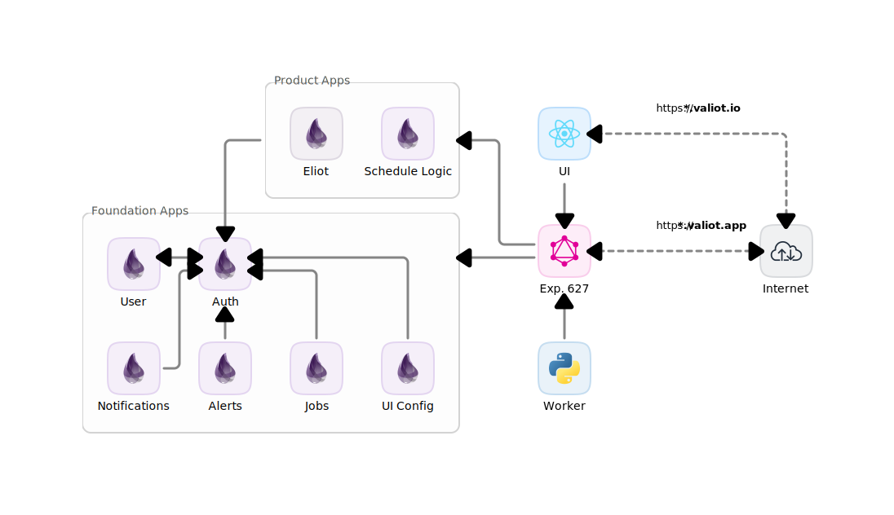

# Composed Workspace

![Valiot - Tech](https://img.shields.io/badge/Valiot-Tech-blue.svg?style=flat-square&logo=data:image/svg+xml;base64,PHN2ZyB4bWxucz0iaHR0cDovL3d3dy53My5vcmcvMjAwMC9zdmciIHhtbG5zOnhsaW5rPSJodHRwOi8vd3d3LnczLm9yZy8xOTk5L3hsaW5rIiB2ZXJzaW9uPSIxLjEiIHdpZHRoPSIxMDAwIiBoZWlnaHQ9IjEwMDAiIHZpZXdCb3g9IjAgMCAxMDAwIDEwMDAiIHhtbDpzcGFjZT0icHJlc2VydmUiPgo8ZGVzYz5DcmVhdGVkIHdpdGggRmFicmljLmpzIDMuNS4wPC9kZXNjPgo8ZGVmcz4KPC9kZWZzPgo8cmVjdCB4PSIwIiB5PSIwIiB3aWR0aD0iMTAwJSIgaGVpZ2h0PSIxMDAlIiBmaWxsPSJyZ2JhKDAsMCwwLDApIi8+CjxnIHRyYW5zZm9ybT0ibWF0cml4KDIyLjc4ODcgMCAwIDIyLjc4ODcgODY4Ljc3OTggNTAwLjQ0MjMpIiBpZD0iUGF0aF83IiBjbGlwLXBhdGg9InVybCgjQ0xJUFBBVEhfNCkiPgo8Y2xpcFBhdGggaWQ9IkNMSVBQQVRIXzQiPgoJPHJlY3QgdHJhbnNmb3JtPSJtYXRyaXgoMSAwIDAgMSAxNi42ODA2IC0wLjAxOTQpIiBpZD0iU1ZHSURfMDAwMDAxODMyMDg5MzM5Njg1NTk2MTc4NjAwMDAwMDM2ODQ5MTQ5NzA0NjEzMzA1OTlfIiB4PSItNTQuMzUiIHk9Ii0xMS4yIiByeD0iMCIgcnk9IjAiIHdpZHRoPSIxMDguNyIgaGVpZ2h0PSIyMi40Ii8+CjwvY2xpcFBhdGg+CjxwYXRoIHN0eWxlPSJzdHJva2U6IG5vbmU7IHN0cm9rZS13aWR0aDogMTsgc3Ryb2tlLWRhc2hhcnJheTogbm9uZTsgc3Ryb2tlLWxpbmVjYXA6IGJ1dHQ7IHN0cm9rZS1kYXNob2Zmc2V0OiAwOyBzdHJva2UtbGluZWpvaW46IG1pdGVyOyBzdHJva2UtbWl0ZXJsaW1pdDogNDsgaXMtY3VzdG9tLWZvbnQ6IG5vbmU7IGZvbnQtZmlsZS11cmw6IG5vbmU7IGZpbGw6IHJnYig4MCwyNTAsMTIpOyBmaWxsLXJ1bGU6IG5vbnplcm87IG9wYWNpdHk6IDE7IiB0cmFuc2Zvcm09IiB0cmFuc2xhdGUoLTM4LjE2OTQsIC0xMS45MTk0KSIgZD0iTSA0My4zIDIwLjQgTCAzNi43IDIgYyAtMC40IC0xIC0xLjUgLTEuNSAtMi41IC0xLjIgYyAtMSAwLjQgLTEuNSAxLjUgLTEuMiAyLjUgbCAwIDAgbCA2LjYgMTguNSBjIDAuNCAxIDEuNSAxLjYgMi41IDEuMiBTIDQzLjcgMjEuNSA0My4zIDIwLjQgTCA0My4zIDIwLjQiIHN0cm9rZS1saW5lY2FwPSJyb3VuZCIvPgo8L2c+CjxnIHRyYW5zZm9ybT0ibWF0cml4KDIyLjc4ODcgMCAwIDIyLjc4ODcgMzAxLjQ0OTggNDk3LjQ4NjUpIiBpZD0iUGF0aF84IiBjbGlwLXBhdGg9InVybCgjQ0xJUFBBVEhfNSkiPgo8Y2xpcFBhdGggaWQ9IkNMSVBQQVRIXzUiPgoJPHJlY3QgdHJhbnNmb3JtPSJtYXRyaXgoMSAwIDAgMSA0MS41NzU4IDAuMTEwMykiIGlkPSJTVkdJRF8wMDAwMDE4MzIwODkzMzk2ODU1OTYxNzg2MDAwMDAwMzY4NDkxNDk3MDQ2MTMzMDU5OV8iIHg9Ii01NC4zNSIgeT0iLTExLjIiIHJ4PSIwIiByeT0iMCIgd2lkdGg9IjEwOC43IiBoZWlnaHQ9IjIyLjQiLz4KPC9jbGlwUGF0aD4KPHBhdGggc3R5bGU9InN0cm9rZTogbm9uZTsgc3Ryb2tlLXdpZHRoOiAxOyBzdHJva2UtZGFzaGFycmF5OiBub25lOyBzdHJva2UtbGluZWNhcDogYnV0dDsgc3Ryb2tlLWRhc2hvZmZzZXQ6IDA7IHN0cm9rZS1saW5lam9pbjogbWl0ZXI7IHN0cm9rZS1taXRlcmxpbWl0OiA0OyBpcy1jdXN0b20tZm9udDogbm9uZTsgZm9udC1maWxlLXVybDogbm9uZTsgZmlsbDogcmdiKDAsMTYyLDI1NSk7IGZpbGwtcnVsZTogbm9uemVybzsgb3BhY2l0eTogMTsiIHRyYW5zZm9ybT0iIHRyYW5zbGF0ZSgtMTMuMjc0MiwgLTExLjc4OTcpIiBkPSJNIDI2IDEuNyBjIC0yLjUgLTEuNyAtNS45IC0xIC03LjYgMS41IGMgLTAuMyAwLjQgLTAuNSAwLjggLTAuNiAxLjIgbCAtMi42IDcuNCBsIC0wLjUgMS4zIGMgMCAwIC0xLjUgNC4zIC0xLjYgNC40IGMgLTAuMiAwLjcgLTAuOSAxLjEgLTEuNyAxLjEgYyAtMC43IDAgLTEuMyAtMC40IC0xLjYgLTEuMSBjIC0wLjEgLTAuMSAtMS42IC00LjQgLTEuNiAtNC40IEwgNC40IDIgQyA0IDEgMi45IDAuNCAxLjggMC44IFMgMC4zIDIuMyAwLjcgMy4zIGMgMCAwIDAgMCAwIDAgbCAzLjUgOS44IGwgMi4yIDYuMSBjIDAuOCAyLjIgMi44IDMuNyA1LjIgMy43IGMgMi40IDAuMSA0LjUgLTEuNCA1LjIgLTMuNiBsIDIgLTUuOCBsIDEgLTIuOSBsIDEuOCAtNS4xIEMgMjIuMiAzLjQgMjMuOSAxLjkgMjYgMS43IiBzdHJva2UtbGluZWNhcD0icm91bmQiLz4KPC9nPgo8ZyB0cmFuc2Zvcm09Im1hdHJpeCgyMi43ODg3IDAgMCAyMi43ODg3IDY2Ni4wOTE3IDUzNC42MjUzKSIgaWQ9IlBhdGhfOSIgY2xpcC1wYXRoPSJ1cmwoI0NMSVBQQVRIXzYpIj4KPGNsaXBQYXRoIGlkPSJDTElQUEFUSF82Ij4KCTxyZWN0IHRyYW5zZm9ybT0ibWF0cml4KDEgMCAwIDEgMjUuNTc0OCAtMS41MTk0KSIgaWQ9IlNWR0lEXzAwMDAwMTgzMjA4OTMzOTY4NTU5NjE3ODYwMDAwMDAzNjg0OTE0OTcwNDYxMzMwNTk5XyIgeD0iLTU0LjM1IiB5PSItMTEuMiIgcng9IjAiIHJ5PSIwIiB3aWR0aD0iMTA4LjciIGhlaWdodD0iMjIuNCIvPgo8L2NsaXBQYXRoPgo8cGF0aCBzdHlsZT0ic3Ryb2tlOiBub25lOyBzdHJva2Utd2lkdGg6IDE7IHN0cm9rZS1kYXNoYXJyYXk6IG5vbmU7IHN0cm9rZS1saW5lY2FwOiBidXR0OyBzdHJva2UtZGFzaG9mZnNldDogMDsgc3Ryb2tlLWxpbmVqb2luOiBtaXRlcjsgc3Ryb2tlLW1pdGVybGltaXQ6IDQ7IGlzLWN1c3RvbS1mb250OiBub25lOyBmb250LWZpbGUtdXJsOiBub25lOyBmaWxsOiByZ2IoODAsMjUwLDEyKTsgZmlsbC1ydWxlOiBub256ZXJvOyBvcGFjaXR5OiAxOyIgdHJhbnNmb3JtPSIgdHJhbnNsYXRlKC0yOS4yNzUyLCAtMTMuNDE5NCkiIGQ9Ik0gMzMuOCAyMC40IEwgMjguNCA1LjEgYyAtMC40IC0xIC0xLjUgLTEuNSAtMi41IC0xLjIgcyAtMS41IDEuNSAtMS4yIDIuNSBsIDUuNCAxNS4zIGMgMC40IDEgMS41IDEuNiAyLjUgMS4yIEMgMzMuNyAyMi42IDM0LjIgMjEuNSAzMy44IDIwLjQiIHN0cm9rZS1saW5lY2FwPSJyb3VuZCIvPgo8L2c+Cjwvc3ZnPg==) 

## Quick setup & run

1. Install *Docker Desktop*: [`https://docs.docker.com/engine/install/`](https://docs.docker.com/engine/install/)

1. Login your *Github* account:

    Create a personal access token (classic, not fine-grained) with the scope `read:packages` checked. You can do this from your *Github* account: [Creating a personal access token](https://docs.github.com/en/authentication/keeping-your-account-and-data-secure/creating-a-personal-access-token#creating-a-personal-access-token-classic).

    Once the token is generated, within the project directory run the following command, replacing `<GITHUB_USER>` with your *Github* username and `<TOKEN>` with the generated one:

    ```sh
    ./wspace login <GITHUB_USER> <TOKEN>
    ```

1. Start the **Composed Workspace** deploy running:

    ```sh
    ./wspace init
    ```

    The whole process will take around 12 minutes and 2.3 GiB of downloaded data, so it's recomended to have a cup of coffee while waiting. Once the downloads, builds, migrations and deployments are done for the first time, the consecutive runs will last less than 1 minute with the `./wspace up` command.

1. Once the **Composed Workspace** is deployed, to see usage info navigate to: [`http://localhost:4010`](http://localhost:4010)

1. Finally, to stop the **Composed Workspace** run:

    ```sh
    ./wspace stop
    ```

## Table of Contents

- [Composed Workspace](#composed-workspace)
  - [Quick setup \& run](#quick-setup--run)
  - [About](#about)
    - [Architecture diagram](#architecture-diagram)
    - [Workspace services](#workspace-services)
    - [Workspace tools](#workspace-tools)
    - [Valiot App services](#valiot-app-services)
  - [Script usage info](#script-usage-info)
  - [System setup](#system-setup)
    - [Authentication](#authentication)
  - [Workspace setup](#workspace-setup)
    - [Initialization](#initialization)
    - [Building containers](#building-containers)
    - [Databases and services setup](#databases-and-services-setup)
  - [Workspace deploy](#workspace-deploy)
    - [All services](#all-services)
    - [Single service](#single-service)
  - [Stop workspace](#stop-workspace)
    - [Stop service(s)](#stop-services)
    - [Remove services](#remove-services)
    - [Docker reset](#docker-reset)
  - [Services' CLI terminal](#services-cli-terminal)
  - [Change UI \& Worker services](#change-ui--worker-services)
    - [Docker images](#docker-images)
    - [Localhost services](#localhost-services)
      - [Localhost UI](#localhost-ui)
      - [Localhost Worker](#localhost-worker)
  - [Workspace for development](#workspace-for-development)
    - [Valiot App](#valiot-app)
      - [Start Valiot App services](#start-valiot-app-services)
      - [Build Valiot App containers](#build-valiot-app-containers)
      - [Stop Valiot App services](#stop-valiot-app-services)
      - [Valiot App tasks](#valiot-app-tasks)

## About

This workspace is an all-in-one solution for effortlessly deploy, test and develop the **Valiot** services ecosystem in a local machine without the need of install anything else than *Docker Desktop*.

It's built over *Docker* containers that resemble the context architecture. Therefore, it guarantees that the deployment behavior will be the same in `prod` environment.

### Architecture diagram



### Workspace services

| Service name | Image version |
| --: | :-- |
| ui | [ghcr.io/valiot/valiot-ui:ui-demo-8961af5](https://ghcr.io/valiot/valiot-ui:ui-demo-8961af5) |
| exp-627 | [ghcr.io/valiot/exp-627:1.4.0](https://ghcr.io/valiot/exp-627:1.4.0) |
| worker | [ghcr.io/valiot/vcos-test-worker:e0045fc](https://ghcr.io/valiot/vcos-test-worker:e0045fc) |
| alerts | [ghcr.io/valiot/alerts:5.0.0](https://ghcr.io/valiot/alerts:5.0.0) |
| auth | [ghcr.io/valiot/valiot-auth:3.3.0](https://ghcr.io/valiot/valiot-auth:3.3.0) |
| blog | [ghcr.io/valiot/blog:2.1.0](https://ghcr.io/valiot/blog:2.1.0) |
| eliot | [ghcr.io/valiot/eliot:8.1.0](https://ghcr.io/valiot/eliot:8.1.0) |
| jobs | [ghcr.io/valiot/jobs:6.0.0](https://ghcr.io/valiot/jobs:6.0.0) |
| notifications | [ghcr.io/valiot/notifications:5.0.0](https://ghcr.io/valiot/notifications:5.0.0) |
| schedule-logic | [ghcr.io/valiot/schedule-logic:4.0.0](https://ghcr.io/valiot/schedule-logic:4.0.0) |
| ui-config | [ghcr.io/valiot/ui-config:2.0.0](https://ghcr.io/valiot/ui-config:2.0.0) |
| user | [ghcr.io/valiot/valiot-user:4.3.0](https://ghcr.io/valiot/valiot-user:4.3.0) |
| elixir-apps-db | [postgres:14](https://hub.docker.com/_/postgres/tags) |

### Workspace tools

| Service name  | Image version |
| --: | :-- |
| wspace-ui | *Source code v1.5.0* |
| pgadmin | [dpage/pgadmin4:latest](https://hub.docker.com/r/dpage/pgadmin4/tags) |

### Valiot App services

| Service name  | Image version |
| --: | :-- |
| valiot-app | *(Requires manual image build from repo).* |
| valiot-app-db | [postgres:14](https://hub.docker.com/_/postgres/tags) |

## Script usage info

To see a reduced version of the script documentation, run:

```sh
./wspace
```

To see the script full documentation, run:

```sh
./wspace help
```

## System setup

In order to work with this repository it is necesary to install *Docker Desktop* on the system. The installation can be done following the documentation in this link: [`https://docs.docker.com/engine/install/`](https://docs.docker.com/engine/install/).

### Authentication

For the use of the workspace it is necesesary to have a *Github* account with access to the services packages, and authenticate *Docker* with it. To do that follow these steps:

1. Create a personal access token (classic, not fine-grained) with the scope `read:packages` checked. You can do this from your *Github* account: [Creating a personal access token](https://docs.github.com/en/authentication/keeping-your-account-and-data-secure/creating-a-personal-access-token#creating-a-personal-access-token-classic).

1. Once the token is generated, within the project directory run the following command, replacing `<GITHUB_USER>` with your *Github* username and `<TOKEN>` with the generated one:

    ```sh
    ./wspace login <GITHUB_USER> <TOKEN>
    ```

## Workspace setup

In order to setup the workspace is necesary to download the services images, build the containers, initialize the elixir app databases, create tokens and permissions and setup those tokens into their respective service. All of this can be done with the following commands:

### Initialization

Perfect for first time runs. It is the combination of the `build`, `setup` and `up` commands functionality:

```sh
./wspace init
```

It excecutes all the following configuration steps:

1. Stops and removes all workspace containers if any.
1. Downloads (if they have not been downloaded before) and builds all docker images.
1. Drops and recreates all services databases.
1. Runs migrations in all elixir app databases.
1. Creates tokens and permissions for specific services.
1. Starts all services.

It's not necesary to run this command to start all the services every time. Once the configuration is done, it will stay in that way until one or more databases are dropped or a database container is removed. The `./wspace up` command is the standard way to start an already configurated workspace.

### Building containers

To assemble the architecture of the workspace, there are the composing images of  services that *Docker* downloads. However, these images must be rebuiled assigning environment variables among other minor workspace setup.

If is needed to download the images again and/or rebuild the containers, it can be done running:

```sh
./wspace build
```

> ℹ️ If already exists a downloaded image by *Docker*, it will not download it again unless that image is removed.

### Databases and services setup

This command drops and recreates all elixir app databases, excecutes the migration files for all of them, creates tokens and permissions for the specific services that uses the authentication tokens and generates `.env` files that configures those services with.

```sh
./wspace setup
```

## Workspace deploy

### All services

To start all workspace services, just run:

```sh
./wspace up
```

This command can receive the `--console` option. This option can receive one or many services and print those services console outputs. If no service is given, it will print the console output of all running services.

### Single service

To start a single service (and the required ones to start it) in a specific port, run the following command.

```sh
./wspace run <SERVICE> <PORT>
```

Whenever the service to start is a elixir app, the command can handle passing the given `<RUN_ARGS>` as container initialization script arguments.

```sh
./wspace run <SERVICE> <PORT> <RUN_ARGS>
```

It will create an extra container for the service. The host console will become the service console output. The service process can be killed pressing `Ctrl + C` or `Cmd ⌘ + C`. The extra container will be removed after is stopped or killed.

## Stop workspace

### Stop service(s)

Stops the given service. If none is given, stops all workspace services.

```sh
./wspace stop <SERVICE>
```

### Remove services

Stops all workspace services and deletes all workspace containers. This action will remove all workspace configuration setup.

```sh
./wspace down
```

> ⚠️ **Warning:** When this command has been run, in order to start the workspace again, the configuration setup process must be excecuted again.

### Docker reset

Stops all services and purges *Docker*. Deletes all (not limited to **Composed Workspace**) downloaded images, build cache, networks, volumes and containers from Docker.

```sh
./wspace reset
```

> ⚠️ **Warning:** All *Docker* images and data will be removed. When this command has been run, in order to start the workspace again, the whole configuration setup process must be excecuted again.

## Services' CLI terminal

For more advanced interaction with the servers, a CLI terminal can be accessed for any container from the *Docker Desktop* aplication since version 4.12: [Integrated terminal for running containers](https://www.docker.com/blog/integrated-terminal-for-running-containers-extended-integration-with-containerd-and-more-in-docker-desktop-4-12/).

Besides the CLI terminal itself, it also offers a console to monitor the service's console logs, the value of all environment variables and CPU and memory usage indicators.

## Change UI & Worker services

### Docker images

If is required to adjust or change the Docker image for `ui` and/or `worker` services, this configuration can be done in the `./workspace-compose.yml` file.

To change the Docker image of a service, just change the `image:` parameter in their respective section.

```yml
services:
  # UI -----------------------------------------------------------------------
  ui:
    container_name: UI
    image: ghcr.io/valiot/valiot-ui:ui-demo-8961af5 # <-- Change this
  ...

  # Worker -------------------------------------------------------------------
  worker:
    container_name: Worker
    image: ghcr.io/valiot/vcos-test-worker:b14a327 # <-- Change this
  ...
```

After the file is updated, the `./wspace build` command must be run to apply the changes to the workspace containers.

### Localhost services

Its posible to use the **Composed Workspace** with localhost services for `ui` and/or `worker` services. The steps to make the setup in each case are explained below.

#### Localhost UI

1. Deploy the workspace as usual:

    ```sh
    ./wspace up
    ```

1. Use the URLs in the workspace menu [`http://localhost:4010`](http://localhost:4010) to set the target URLs environment varibles of the localhost `ui` service.

1. Start the localhost `ui` service.

#### Localhost Worker

1. Deploy the workspace as usual:

    ```sh
    ./wspace up
    ```

1. Stop the workspace `worker` service:

    ```sh
    ./wspace stop worker
    ```

1. Use the URLs and deployed resourses in the workspace menu [`http://localhost:4010`](http://localhost:4010) to set the environment varibles of the localhost `worker` service.

1. Start the localhost `worker` service.

## Workspace for development

### Valiot App

The workspace offers some developing tools for the **Valiot App** repository.

#### Start Valiot App services

To start all **Valiot App** services:

```sh
./wspace valiot-app.up
```

#### Build Valiot App containers

If is needed to rebuild the containers again, it can be done running:

```sh
./wspace valiot-app.build
```

This command can receive the `--console` option. This option can receive one or many services and print those services console outputs. If no service is given, it will print the console output of all running services.

#### Stop Valiot App services

To stop all **Valiot App** services, run:

```sh
./wspace valiot-app.stop
```

#### Valiot App tasks

The following commands creates an extra container for the service and when the process is done automatically exits and removes the extra container:

  1. **Database Setup**

      To setup the valiot-app service database, navigate to the project directory and run the following command. `<ENV>` argument points to the environment database: `dev`, `prod` or `test`, if no argument is given it will set `test` for default.

      ```sh
      ./wspace valiot-db.setup <ENV=test>
      ```

  1. **Unit Testing**

      To run the valiot-app service automated unit testing. It's possible to use all the `mix test` command options, like but not limited to `--trace`, `--failed`, `--max_failures`, `--seed` or `--only`.

      In order to validate with the automated unit tests the current **Valiot App**. It's needed to run the `./wspace valiot-app.setup` command first.

      ```sh
      ./wspace valiot-app.test
      ```

The following commands creates an extra container for the service and the host console will become the service console output. The service process can be killed pressing `Ctrl + C` or `Cmd ⌘ + C`. The extra container will be removed after is stopped or killed:

  1. **Tests coverage**

      Starts the valiot-app service and runs the `mix.coveralls` command to generate the unit testing coverage report. Once it have completed, starts the valiot-app service in development environment.

      ```sh
      ./wspace valiot-app.coverage
      ```

      In order to validate with the automated unit tests the current **Valiot App**. It's needed to run the `./wspace valiot-app.setup` command first.

  1. **Start in development**

      Starts the valiot-app service in development environment: `MIX_ENV=dev`

      ```sh
      ./wspace valiot-app.dev
      ```

  1. **Start in production**

      Starts the valiot-app service in production environment: `MIX_ENV=prod`

      ```sh
      ./wspace valiot-app.prod
      ```

  1. **Start with *Interactive Elixir***
  
      Starts the valiot-app service in development environment within an Elixir interactive console.

      ```sh
      ./wspace valiot-app.iex
      ```

  1. **Start with custom commands**
  
      Starts the valiot-app service passing the given `<RUN_ARGS>` as container initialization script arguments.

      ```sh
      ./wspace valiot-app.run <RUN_ARGS>
      ```
